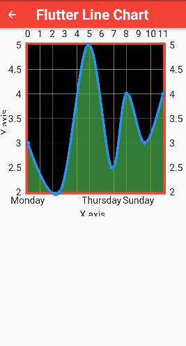
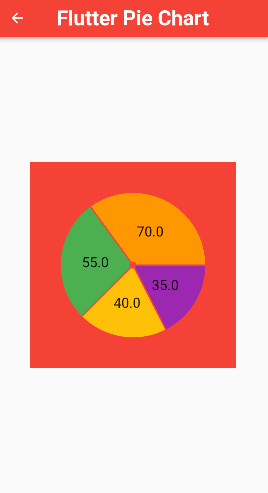
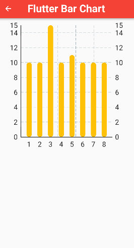

## 1. Research: Flutter fl_chart Package

- Keywords:
    - fl chart flutter
    - flutter fl charts
    - flutter charts
    - flutter chart library
    - flutter fl chart example
    - horizontal bar chart flutter
    - flutter chart example
    - flutter line chart example
    - flutter charts example
    - flutter charts and graphs
    - charts flutter
    - flutter charts github
    - flutter bar chart example
    - vertical bar chart flutter
    - flutter fl line chart
- Video
  Title: Flutter FL Charts - Flutter FL Line Chart, Pie Chart, Bar Chart with Example

## 2. Research: Competitors

**Flutter Videos/Articles**

- 36K: https://www.youtube.com/watch?v=LB7B3zudivI
- 4.8K: https://www.youtube.com/watch?v=Iv3F2HO5Jvc
- 10K: https://www.youtube.com/watch?v=7wUmzYOPQ8w
- 16K: https://www.youtube.com/watch?v=rZx_isqXrhg
- 8.8K: https://www.youtube.com/watch?v=1pjAItIDNz8
- 3K: https://www.youtube.com/watch?v=msMxuUERtg8
- 8.5K: https://www.youtube.com/watch?v=xHzDAewbSGY
- 3.8K: https://www.youtube.com/watch?v=JBJ6o4blgPA
- https://pub.dev/packages/fl_chart
- https://pub.dev/documentation/fl_chart/latest
- https://github.com/imaNNeo/fl_chart
- https://blog.logrocket.com/build-beautiful-charts-flutter-fl-chart/
- https://www.atatus.com/blog/design-stunning-charts-with-fl-charts-in-flutter/
- https://www.technicalfeeder.com/2022/02/flutter-line-chart-with-a-great-graph-tool-fl_chart/
- https://medium.flutterdevs.com/animated-chart-in-flutter-6f28387f398b
- https://www.uplabs.com/posts/fl-chart
- https://www.syncfusion.com/flutter-widgets/flutter-charts
- https://www.kindacode.com/article/how-to-make-bar-charts-with-fl_chart-in-flutter/
- https://www.kindacode.com/article/how-to-make-line-charts-in-flutter/
- https://itnext.io/bar-charts-in-flutter-8a10c3592bbf

**Android/Swift/React Videos**

- 5.4K: https://www.youtube.com/watch?v=ZFwOJvS9fKY
- Playlist: https://www.youtube.com/watch?v=N-_X6G1KgAY&list=PLFh8wpMiEi89LcBupeftmAcgDKCeC24bJ
- 10K: https://www.youtube.com/watch?v=dL8VyvLJ2d8
- 9.3K: https://www.youtube.com/watch?v=dzZQNsHhqQs
- 74K: https://www.youtube.com/watch?v=vhKtbECeazQ
- 22K: https://www.youtube.com/watch?v=7wXqyqltRyw
- 1.6K: https://www.youtube.com/watch?v=AlhJNybYcHk
- 5.2K: https://www.youtube.com/watch?v=aI5L2bqlRT4
- 41K: https://www.youtube.com/watch?v=J9hl7HHXNHU
- 50K: https://www.youtube.com/watch?v=mWhwe_tLNE8
- 11K: https://www.youtube.com/watch?v=8yPOyh5T2nc
- 14K: https://www.youtube.com/watch?v=F-dt0vOQ4Vg
- 12K: https://www.youtube.com/watch?v=nn34Kz0g5HE
- 70K: https://www.youtube.com/watch?v=GNf-SsDBQ20
- 1.1K: https://www.youtube.com/watch?v=P5A2zoDsh_E
- 20K: https://www.youtube.com/watch?v=O_6GVQ1EwfY
- 29K: https://www.youtube.com/watch?v=xeLdmn3se1I
- 5.2K: https://www.youtube.com/watch?v=nTuqLYCDMIc
- https://www.npmjs.com/package/react-native-chart-kit
- https://instamobile.io/react-native-tutorials/react-native-charts/
- https://reactnativeexample.com/tag/chart/
- https://www.educba.com/react-native-charts/
- https://medium.com/@mobindustry/how-to-quickly-implement-beautiful-charts-in-your-android-app-cf4caf050772
- https://www.anychart.com/technical-integrations/samples/android-charts/
- https://github.com/AnyChart/AnyChart-Android
- https://www.geeksforgeeks.org/how-to-create-a-barchart-in-android/
- https://www.geeksforgeeks.org/android-create-a-pie-chart-with-kotlin/
- https://developer.android.com/guide/navigation/navigation-kotlin-dsl
- https://developer.apple.com/documentation/charts
- https://developer.apple.com/documentation/charts/creating-a-chart-using-swift-charts
- https://www.kodeco.com/36025169-swift-charts-tutorial-getting-started
- https://github.com/danielgindi/Charts

**Great Features**

- Fl Chart is a highly customizable Flutter chart library that supports Line Chart, Bar Chart, Pie
  Chart, Scatter Chart, and Radar Chart.
- You can find more at [pub.dev](https://pub.dev/documentation/fl_chart/latest/)

**Problems from Videos**

- Question: Is there a way to dynamically change the labels of the graph?
    Answer: You can dynamically change the labels by returning a variable in the titlesData
  parameter of the LineChartData which is under the LineChart widget. The titlesData contains the
  topTitle, bottomTitle, leftTitle, and rightTitle. Specifically the getTitles parameter.
- Question: How to use firestore Data for chart info?
   
  Answer: [Follow this link](https://medium.com/@codingInformer/how-to-use-flutter-time-series-charts-with-firebase-6f3f364b5902):
- Question: I am getting the error that parameter colors is not defined.
   
  Answer: [Follow this link](https://stackoverflow.com/questions/63863187/flutter-the-named-parameter-colors-isnt-defined-in-sweepgradient):
- Question: Is there any way to create a stacked bar chart similar to what the google charts
  solution can provide?
   
  Answer: [Follow this link](https://google.github.io/charts/flutter/example/bar_charts/stacked.html):
- Question: How do you adjust the height of the entire bar graph?
   
  Answer: [Follow this link](https://stackoverflow.com/questions/56328616/how-do-i-set-the-max-height-on-a-flutter-horizontal-bar-chart):
- Question: How do I change the padding between bars?
   
  Answer: [Follow this link](https://stackoverflow.com/questions/59047870/how-to-change-width-of-bar-in-bar-charts-in-charts-flutter):
- Question: How can we display the data from the realtime database firebase?
   Answer: With streamBuilder

**Problems from Flutter Stackoverflow**

- https://stackoverflow.com/questions/72245312/fl-chart-barchart-sample5-need-help-resolving-the-errors
- https://stackoverflow.com/questions/75567383/how-to-show-date-on-bottomtitle-in-fl-chart
- https://stackoverflow.com/questions/72325380/fl-chart-error-the-getter-touchinput-isnt-defined-for-the-type-fltouchevent
- https://stackoverflow.com/questions/73701575/fl-chart-want-to-add-last-one-week-dates-in-bottomtitles-in-linechart
- https://stackoverflow.com/questions/73151783/flutter-fl-chart-prevent-highest-value-left-title-from-being-cut-off
- https://stackoverflow.com/questions/75300309/fl-charts-barchart-title-issues-switch-case
- https://stackoverflow.com/questions/72051299/unable-to-show-the-y-axis-value-in-bar-tooltip-by-default-using-fl-chart-package

## 3. Video Structure

**Main Points / Purpose Of Lesson**

1. By watching this video, you will be able to understand, make and customize line, pie and bar
   chart in flutter using fl chart package.
2. In this video, three types of charts are discussed:
    - Line chart
    - Pie chart
    - Bar chart
3. Hence, fl chart is very easy and important package to understand and use.

**The Structured Main Content**

1. Run `flutter pub add fl_chart` in terminal to add [fl_chart](https://pub.dev/packages/fl_chart)
   package in your project's pubspec.yaml file.
2. For this video, `home_page.dart` is main page of project.
3. `line_chart_page.dart` contains Bar Chart in it.
   
   Some properties of **BarChart** which are used in this project are following:

| PropName        | Description                                                                                   |
|:----------------|:----------------------------------------------------------------------------------------------|
| lineBarsData    | list of `LineChartBarData` to show the chart's lines, these can be drawn on top of each other |
| betweenBarsData | list of `BetweenBarsData` to fill the area between 2 chart lines                              |
| titlesData      | data of titles using `FlTitlesData`                                                           |
| axisTitleData   | data of axis titles using `FlAxisTitleData`                                                   |
| gridData        | data of grid within the borders using `FlGridData`                                            |
| borderData      | data of border using `FlBorderData`                                                           |
| minX            | starting point of x axis                                                                      |
| maxX            | ending point of x axis                                                                        |
| minY            | starting point of y axis                                                                      |
| maxY            | ending point of y axis                                                                        |
| backgroundColor | a background color which is drawn behind th chart                                             |

  Properties of **LineChartBarData**:

| PropName     | Description                                                                  |
|:-------------|:-----------------------------------------------------------------------------|
| spots        | list of `FlSpot`'s (or dots) x and y coordinates that the line go through it |
| color        | color of the line                                                            |
| barWidth     | stroke width of the line bar                                                 |
| isCurved     | show curves instead of line between dots or spots                            |
| dotData      | data of dots `FlDotData`                                                     |

4. `pie_chart_page.dart` contains Pie Chart in it.
   
   Properties of **PieChartData**:

| PropName          | Description                                                                                                     |
|:------------------|:----------------------------------------------------------------------------------------------------------------|
| sections          | list of `PieChartSectionData` that is shown on the pie chart                                                    |
| centerSpaceRadius | free space in the middle of the PieChart                                                                        |
| centerSpaceColor  | color of free space in the middle of the PieChart                                                               |
| sectionsSpace     | space between the sections of PieChart                                                                          |
| pieTouchData      | `PieTouchData` holds the touch interactivity details like to show as popup when user touches a specific section |
| borderData        | data of border around the chart using `FlBorderData`                                                            |

  Properties of **PieChartSectionData**:

| PropName                      | Description                                                                           |
|:------------------------------|:--------------------------------------------------------------------------------------|
| value                         | value is the weight of each section, total weight of PieChart is 100.                 |
| color                         | colors the section                                                                    |
| radius                        | the width radius of each section                                                      |
| showTitle                     | true to show or false to hide the titles on each section                              |
| titleStyle                    | TextStyle of the titles                                                               |
| title                         | title of the section                                                                  |
| borderSide                    | border around the section                                                             |

5. `bar_chart_page.dart` contains Bar Chart in it.
   
   Properties of **BarChartData**:

| PropName         | Description                                                                                      |
|:-----------------|:-------------------------------------------------------------------------------------------------|
| barGroups        | list of `BarChartGroupData` to show the bar lines together                                       |
| groupsSpace      | space between groups, it applies only when `alignment(BarChartAlignment)` is `Alignment.center`, |
| alignment        | alignment of the barGroups using `BarChartAlignment`                                             |
| titlesData       | data of titles using `FlTitlesData`                                                              |
| axisTitleData    | data of axis titles using `FlAxisTitleData`                                                      |
| backgroundColor  | a background color which is drawn behind the chart                                               |
| barTouchData     | `BarTouchData` holds the touch interactivity details                                             |
| gridData         | data of grid inside the border using `FlGridData`                                                |
| borderData       | data of border using `FlBorderData`                                                              |
| maxY             | gets maximum y of y axis                                                                         |
| minY             | gets minimum y of y axis                                                                         |

  Properties of **BarChartGroupData**:

| PropName                 | Description                                           |
|:-------------------------|:------------------------------------------------------|
| x                        | x position of the group on horizontal axis            |
| barRods                  | list of `BarChartRodData` that are a bar line         |
| barsSpace                | the space between barRods of the group                |
| showingTooltipIndicators | indexes of barRods to show the tooltip on top of them |
